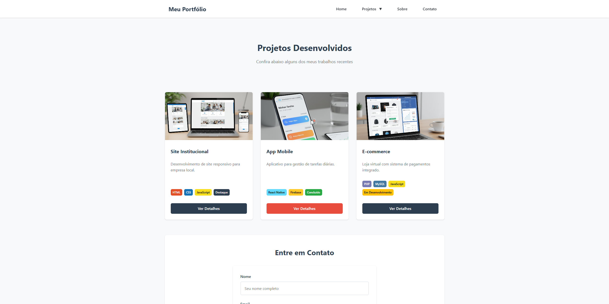

# css-layouts

Um portfólio moderno e responsivo desenvolvido com HTML5 e CSS3, seguindo as melhores práticas de desenvolvimento web e design system.

## 🚀 **Demonstração**

[🔗 **Acesse o Projeto Online**](https://luanpaula.github.io/css-layouts/)

## 📋 **Sobre o Projeto**

Este projeto foi desenvolvido como parte da **Entrega II - Estilização e Leiautes**, focando na aplicação de CSS3 para criar uma interface profissional, responsiva e acessível. O portfólio demonstra domínio de leiautes modernos, sistemas de design e técnicas avançadas de estilização.

### **🎯 Objetivos Atendidos**

- ✅ **CSS Organizado** - Estrutura modular e semântica
- ✅ **Sistema de Design** - Design system consistente com variáveis CSS
- ✅ **Componentes de Interface** - Cards, botões, formulários e feedbacks
- ✅ **Leiautes Responsivos** - Grid CSS e Flexbox com 5 breakpoints
- ✅ **Navegação Sofisticada** - Menu hamburguer e dropdowns

## 🛠 **Tecnologias Utilizadas**

- **HTML5** - Estrutura semântica e acessível
- **CSS3** - Estilização avançada com:
  - CSS Grid e Flexbox
  - Variáveis CSS customizadas
  - Animações e transições
  - Media Queries responsivas
- **Metodologia** - CSS modular e componentizado

## ✨ **Funcionalidades**

### **🎨 Sistema de Design**
- **Paleta de Cores**: 8 cores (primárias, secundárias, neutras)
- **Tipografia**: Hierarquia com 5 tamanhos de fonte
- **Espaçamento**: Sistema modular (8px, 16px, 24px, 32px, 48px, 64px)
- **Componentes**: Design system consistente

### **📱 Layout Responsivo**
- **5 Breakpoints**:
  - X-Small: ≤ 576px (Mobile portrait)
  - Small: 577px - 768px (Mobile landscape)
  - Medium: 769px - 992px (Tablets)
  - Large: 993px - 1200px (Laptops)
  - X-Large: ≥ 1201px (Desktops)
- **Grid System**: 12 colunas customizado
- **Mobile First**: Abordagem responsiva

### **🧩 Componentes Implementados**
- **Cards Responsivos** - Para exibição de projetos
- **Sistema de Botões** - Estados hover, focus, active, disabled
- **Formulários Estilizados** - Validação visual integrada
- **Componentes de Feedback** - Alerts, modais e toasts
- **Badges e Tags** - Sistema de categorização
- **Navegação Avançada** - Menu hamburguer com dropdowns

### **🎯 Interatividade**
- **Menu Hamburguer** - Animação suave de abertura/fechamento
- **Modais** - Popups centralizados com bloqueio de scroll
- **Dropdowns** - Navegação hierárquica responsiva
- **Validação de Formulário** - Feedback visual em tempo real
- **Animações CSS** - Transições suaves e microinterações